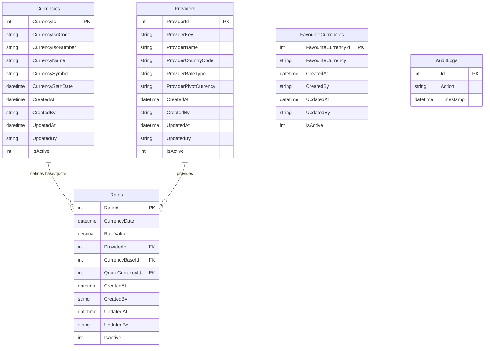
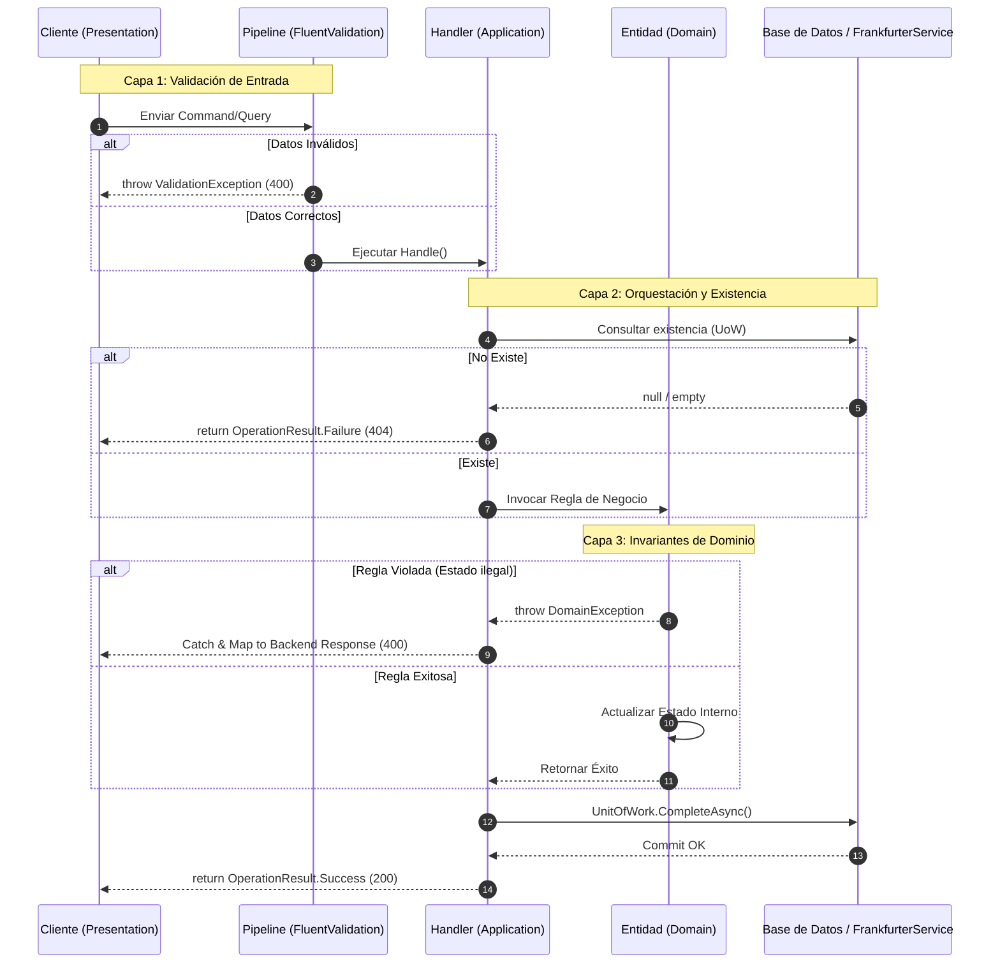
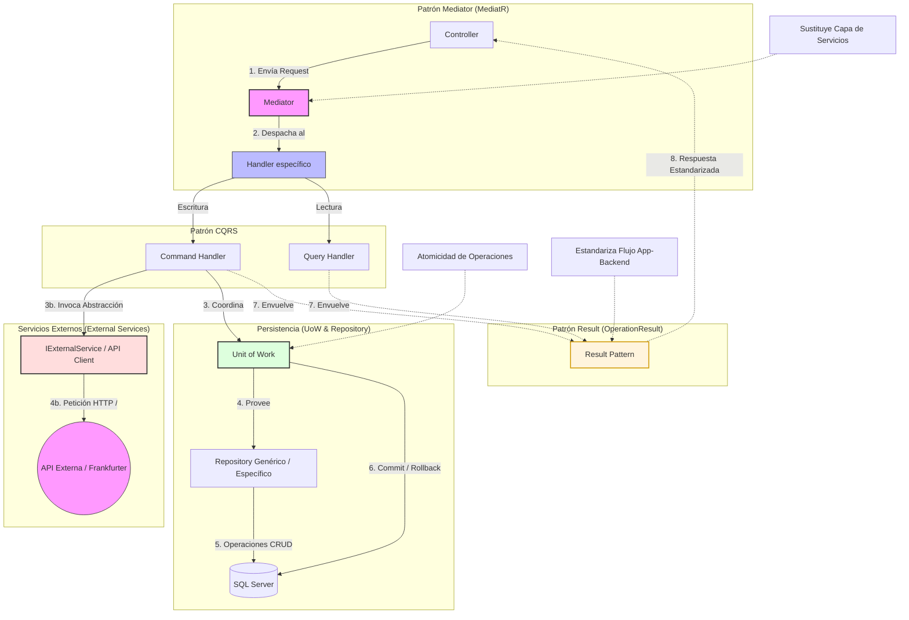
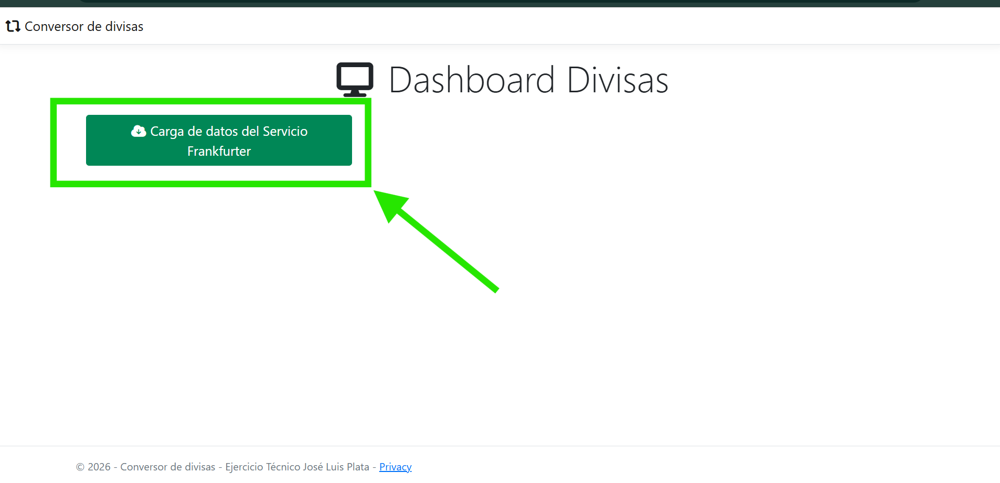
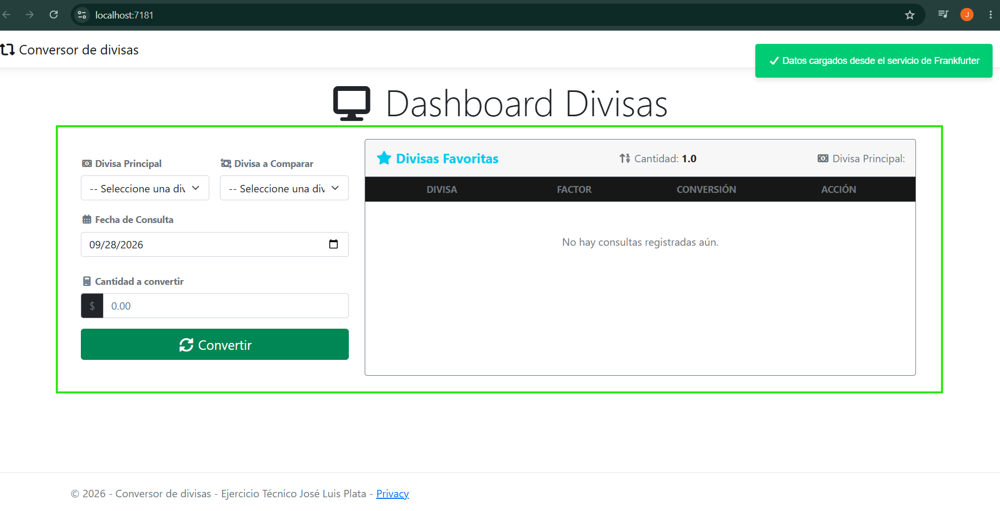
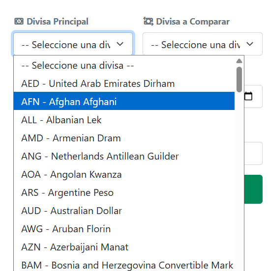
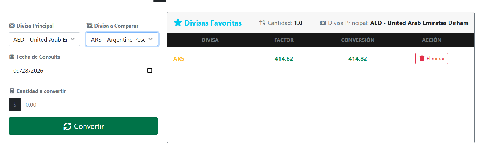
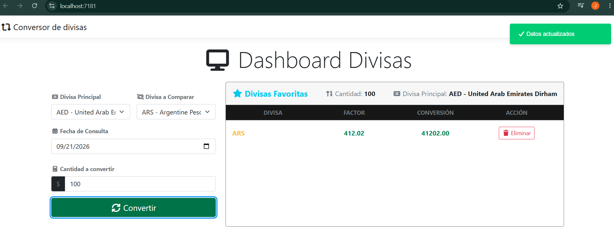
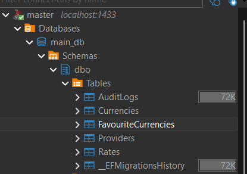
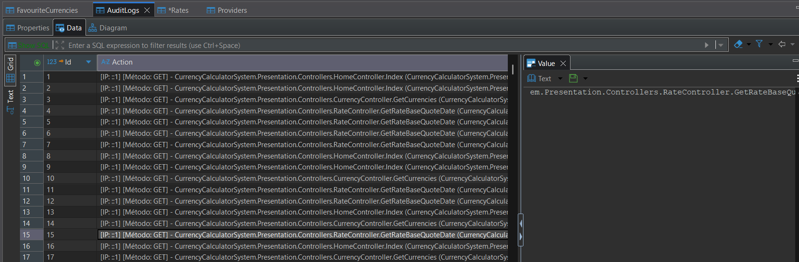

# Prueba Técnica - Desarrollador .NET

## 📋 Información General

| Concepto              | Detalle                                      |
| --------------------- | -------------------------------------------- |
| **Tiempo límite**     | 2 días calendario desde la recepción         |
| **Stack tecnológico** | .NET 8, Entity Framework Core, SQL Server    |
| **Arquitectura base** | Clean Architecture                           |
| **Entrega**           | Repositorio público en GitHub                |

### Repositorio Git

```bash
https://github.com/joseluisplataglez-ctrl/calculadora-divisas-test.git
```

> ⚠️ **Importante:** El aplicativo al momento de levantar aplicará las migraciones pendientes en la base de datos(ContextDb y AuditContextDB) por lo que solo es necesario cambiar la cadena de conexión
---

# Decisiones de Diseño

## 1. Arquitectura y Datos
[Dominio]
```bash
#  La capa de DOMINIO esta preparada para poder escalar y mantenerse de acuerdo a un enfoque DDD por lo que contiene 
# lo necesario para ajustar campos, aplicar reglas de negocio y extenderse, además de que se utilizó una clase abstracta 
# para reutilizar campos de auditoria

```
[Application]
```bash
# La capa de APPLICATION se integra por contratos de aplicación, DTOs de transferencia tanto a las solicitudes del backend
# como para peticiones con servicios externos, manejo de excepciones globales, perfiles de mapeo y los casos de uso.
# La capa esta preparada para extenderse y aunque se llena de varios espacios de nombre es más fácil realizar cualquier mantenimiento

```
[Infrastructure]
```bash
# La capa de INFRASTRUCTURE contempla el acceso a datos (SQL Server), configuraciones de migración, servicios externos, de localizción
# y la configuración para los logs (bitacoras)

```

[Presentation]
```bash
# La capa de PRESENTATION consolida las solicitudes mediante CQRS a los casos de uso mediante MediatR dentro de los controllers
# , además dentro de los middlewares se agregaron los filtros personalizados para las peticiones Http, excepciones globales y LogAction 
# que registran la actividad de las peticiones al backend. Contiene el patron OperationResult para homologar las respuestas hacia el
# frontend, las vistas (todo dentro de Index) y manejo de errores.

```




## 2. Ubicación de Reglas de Negocio  
[Validaciones de datos]
```bash
# Validaciones de Entrada - [Application - FLuentValidation] (apoyado de la IPipelineBehaivor para cada campo)
# Reglas de Estado e Invariantes [Domain - Entities] (validaciones internas con excepcionDomain)
# Validaciones de exitencia [Application - Handlers] (Orquestción de existencia de objetos en BD con UoW)
```




## 3. Patrones Utilizados
[Razonamiento de patrones de diseño utilizados]
```bash
#  1. Repository .- Estructura las operaciones genericas para CRUD de datos adenmas de crear una estructura que prepara el UoW

#  2. CQRS .- Separación de las operaciones de lectura y escritura

#  3. Mediator .- Desacopla los controladores de la lógica de negocio ( sustituye a la capa se servicios)

#  4. UnitOfWork .- Permite la atomicidad para mantener varias operaciones en la BD simulando incluso COMMITS, ROLLBACKS

#  5. Result Pattern .- Estructura el flujo normal del programa para la estenderización entre la capa de aplicación y de presentación

#  6. Strategy Pattern .- Para el manejo global de excepciones se provee y contemplan los diferentes tipos de excepciones a nivel
# dominio, aplicación o lógica de negocio

# 7. FactoryPattern.- Para el caso de los errores / excepciones de respuesta de errors a ProblemDetailFactory para que construya esa respuesta

```



## 4. Frontend
[Resumen]
```bash
#  Se respeta la estructura MVC otorgada por la plantila de ASP.NET Core MVC que además cuenta con Boostrap para los estilos y jQuery
#  para el dinamismo de la página, se agregan iconos FontAwesome para mejorar el diseño y se trata de manejar clean code para no abusar
#  de las funciones engorrosas de lado del frontend

```


## 5. Trade-offs y Limitaciones
[Pendientes]
```bash
#  Agregar gráficas para una mejor lectura de las comparaciones / conversiones de las divisas
#  Dockerizar el aplicativo para poderse ejecutar en cualquier entorno
#  Despliegue dentro de Azure

```
## 6. Usabilidad

<div style="box-shadow: 0 4px 8px 0 rgba(0,0,0,0.2);
  transition: 0.3s;">
  <div style="text-align:center;font-weight: bold; background-color: #A7CFDB;">
    <h4 ><b style="color: white">
    
## Carga de datos desde Frakfurter Service
</b></h4>
  </div>
  

</div>

------

<div style="box-shadow: 0 4px 8px 0 rgba(0,0,0,0.2);
  transition: 0.3s;">
  <div style="text-align:center;font-weight: bold; background-color: #A7CFDB;">
    <h4 ><b style="color: white">
    
## Panel Principal
</b></h4>
  </div>
  

</div>

-------

<div style="box-shadow: 0 4px 8px 0 rgba(0,0,0,0.2);
  transition: 0.3s;">
  <div style="text-align:center;font-weight: bold; background-color: #A7CFDB;">
    <h4 ><b style="color: white">
    
## Seleccion Divisas
</b></h4>
  </div>
  

</div>

-------

<div style="box-shadow: 0 4px 8px 0 rgba(0,0,0,0.2);
  transition: 0.3s;">
  <div style="text-align:center;font-weight: bold; background-color: #A7CFDB;">
    <h4 ><b style="color: white">
    
## Visualizacion Divisas
</b></h4>
  </div>
  

</div>

-------

<div style="box-shadow: 0 4px 8px 0 rgba(0,0,0,0.2);
  transition: 0.3s;">
  <div style="text-align:center;font-weight: bold; background-color: #A7CFDB;">
    <h4 ><b style="color: white">
    
## Calculos
</b></h4>
  </div>
  

</div>

-------

<div style="box-shadow: 0 4px 8px 0 rgba(0,0,0,0.2);
  transition: 0.3s;">
  <div style="text-align:center;font-weight: bold; background-color: #A7CFDB;">
    <h4 ><b style="color: white">
    
## Estructura Base de Datos
</b></h4>
  </div>
  

</div>

-------

<div style="box-shadow: 0 4px 8px 0 rgba(0,0,0,0.2);
  transition: 0.3s;">
  <div style="text-align:center;font-weight: bold; background-color: #A7CFDB;">
    <h4 ><b style="color: white">
    
## Bitacora - Logs
</b></h4>
  </div>
  

</div>
